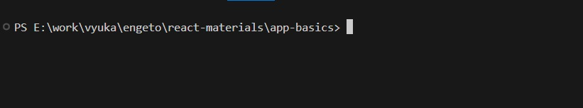

# VYSVĚTLIVKY

## Jak rozchodit projekt

Aby ti projekt fungoval, potřebuješ si nainstalovat [Nodejs Runtime](https://nodejs.org/en).
Zároveň potřebuješ Npm nebo Yarn, což jsou správci balíčků, je v podstatě jedno , která si vybereš, yarn je rychlejší.
Npm se nainstaluje automaticky při instalaci NodeJs, yarn si musíš nainstalovat zvlášť -> [instrukce k instalaci](https://classic.yarnpkg.com/lang/en/docs/install/#windows-stable).
Úspěšné nainstalování Nodejs a npm ověříš tak, že klikneš na Windows tlačítko na klávesnici a napíše cmd, otevře se ti command prompt a do něj napíšeš:

- node -v (měla by se ti zobrazit verze node)
- npm nebo yarn -v (měla by se ti zobrazit verze npm nebo yarnu, dle toho co chceš používat)

Je možné, že se ti verze neukážou, možná bude potřeba restartovat PC, aby to šlo.
Poslední krok je otevřít si projekt v nějakém editoru - na frontend je dobrý VSCode a otevřít konzoli v rootu projektu viz. .
Jako první do konzole napíšeš npm install nebo yarn install a počkej, až se ti stáhnou a nainstalují potřeba závislosti projektu.
Až to bude hotové tak už jen do konzole napíšeš npm start a projekt by se ti měl pomalu začít spouštět. Spustí se ti na [localhostu](http://localhost:3000/).

## Vysvětlivky k projektu

V projektu jsou ukazáné naprosté základy reactu, než se je naučíš, měl bych stihnout pokračovat a dát ti něco komplexnějšího.

- První co by tě mělo zajímat je složka komponents, React je naložený na komponentách, které můžeš využívat kdekoliv si zamaneš. To jakým způsobem se používají najdeš v souboru App.js

- Druhá věc, je samotné JSX, v základe jde v podstatě o rozšířené XML. Konkrétně je to zkratka pro Javascript XML. Umožňuje nám to psát HTML-like syntaxi přímo do javascriptích souborů. Můžeš si všimnout, že u některých souborů je koncovka .jsx, toho si moc nevšímej, můžeš používat i konvovku .js a nic by se nemělo změnit. JSX nám taky umožňuje psát javascriptí kód přímo do našeho "HTML", problematika je více popsaná v komponentách MovieCard.jsx a MovieCards.jsx

- Další základní věc, kterou je třeba pochopit jsou Props. Můžeš si všimnout, že všechny komponenty jsou vlastně jen Funkce a props jsou v podstatě jen její argumenty, které můžeš do komponenty poslat a pracovat s nimi. Nic víc, Více je vysvětlené v App.js a Header.jsx

- Do projektu jsem ti zapojil i dva základní Hooky, useState a useEffect. UseState je vysvětlený v komponentě Counter.jsx. UseEffect je vysvětlený v komponentě Timer a UserBoxes.jsx
